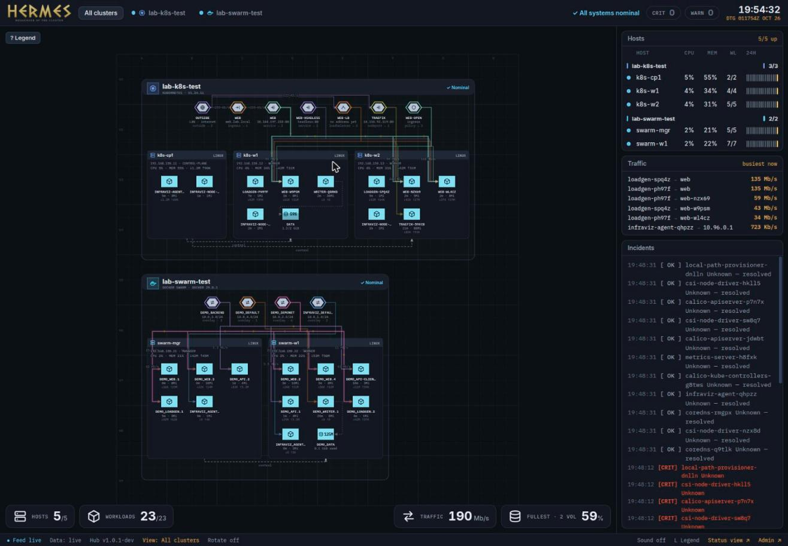
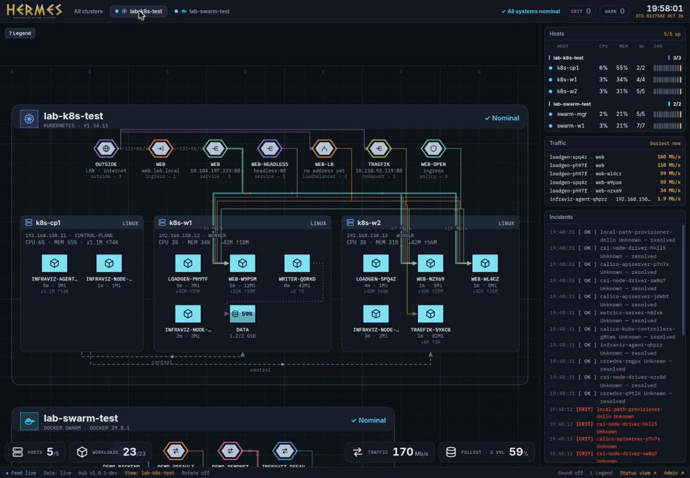
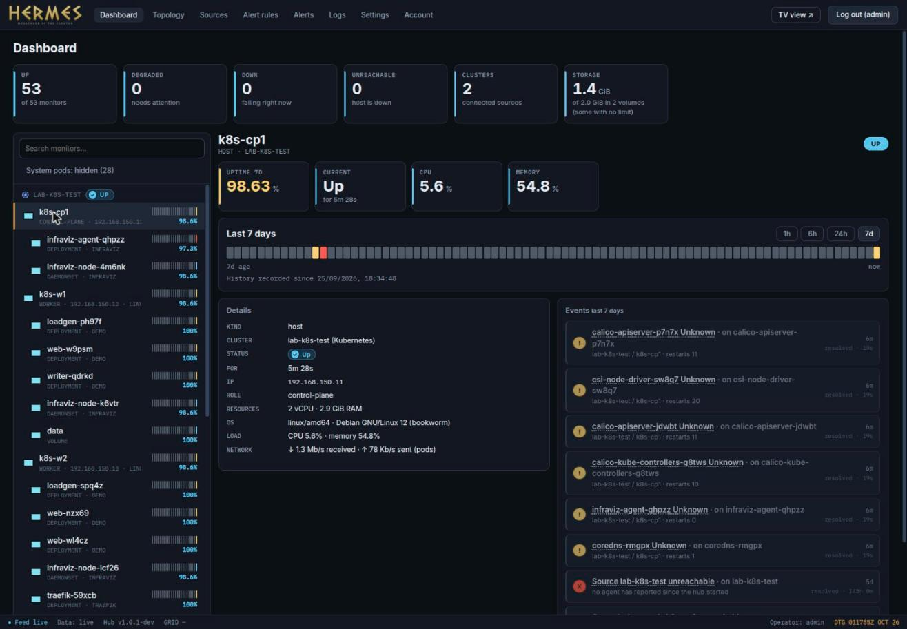
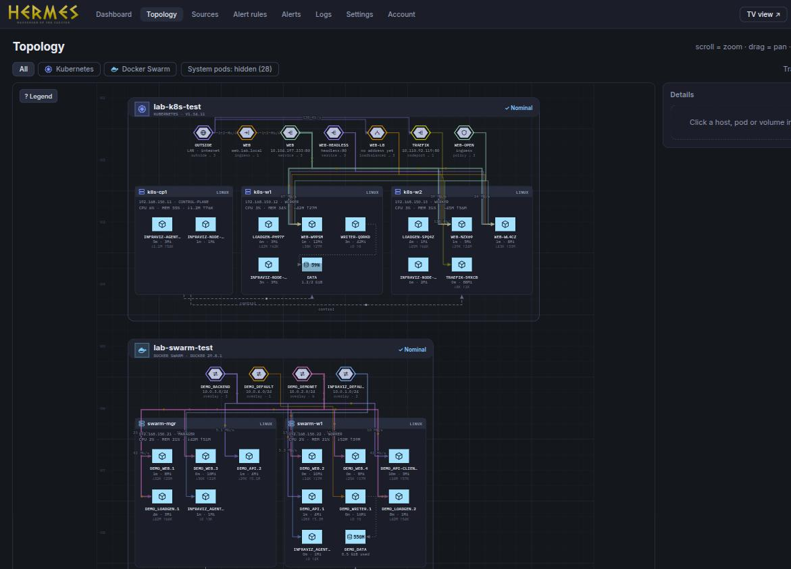
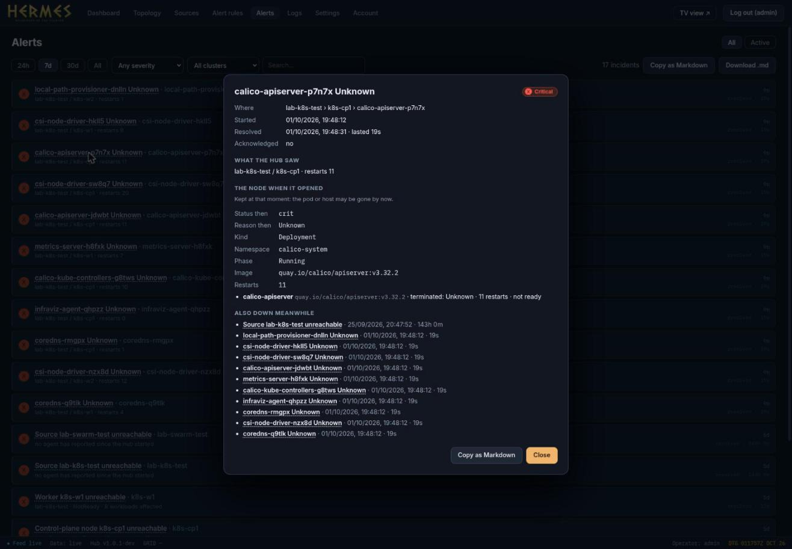
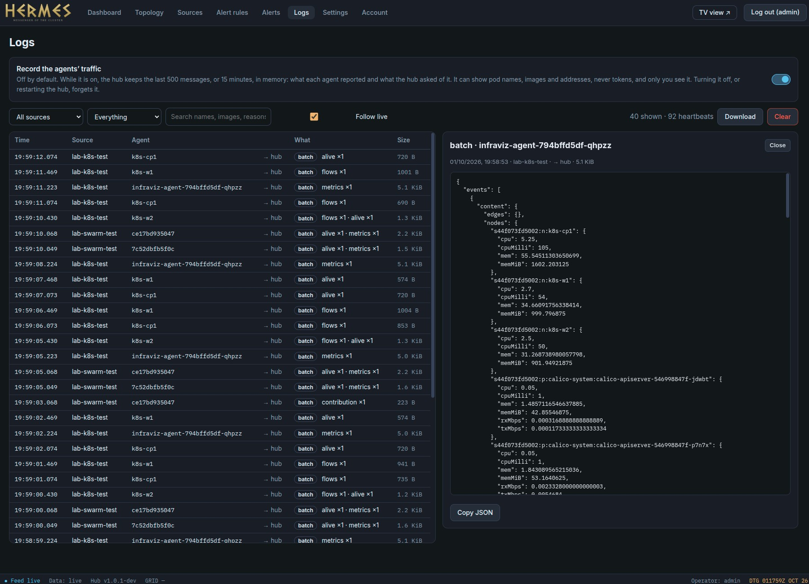

<p align="center">
  
</p>

<p align="center">
  <a href="https://github.com/GoForMusic/Hermes-cluster-vizualization/actions/workflows/ci.yml"></a>
  <a href="https://github.com/GoForMusic/Hermes-cluster-vizualization/releases"></a>
  <a href="https://github.com/GoForMusic/Hermes-cluster-vizualization/releases"></a>
  <a href="https://github.com/GoForMusic/Hermes-cluster-vizualization/releases"></a>
  <a href="LICENSE"></a>
</p>

A live map of your Kubernetes and Docker Swarm (soon Nomad) clusters: hosts, workloads, volumes, traffic and incidents,
with a read-only wallboard for a TV on the LAN and an admin panel. Problems show up the moment they happen.

<p align="center">
  
  
</p>
<p align="center">
  
  
  
</p>
<p align="center">
  
</p>

The TV wallboard (`#/tv`) has a second, simpler view (`#/tv/status`): one uptime bar per host, Uptime-Kuma style, for a screen that only needs a yes/no.

One repository, one Cargo workspace (Rust), three deliverables:

| Folder | What it is | Published as |
|---|---|---|
| `hermes-server/` | the hub (Rust): REST + Server-Sent Events for the browser, gRPC for the agents, live state, alert rules, SQLite, login; **HERMES**, the web app (TV wallboard + admin panel), in `web/`; `deploy/` | image `hermes-server`, tag `server-X.Y.Z` |
| `agent-linux/` | agent (Rust) for Kubernetes and for Docker Swarm nodes running Linux | image `hermes-agent-linux`, tag `agent-linux-X.Y.Z` (`linux/amd64`) |
| `agent-windows/` | agent (Rust) for Docker Swarm nodes running Windows | image `hermes-agent-windows`, tag `agent-windows-X.Y.Z` (`windows/amd64`, `-ltsc2022` and `-ltsc2019`) |
| `pkg/` + `proto/` | what all of them share: the gRPC contract (`proto/`, generated by `pkg/proto`), and `pkg/agentkit` (settings, uplink, run loop) | — |

```
proto/infraviz/v1/      agent.proto: the contract (agent <-> hub, gRPC over TLS)
proto/cri/v1/           the one call of the container runtime interface the node agent uses
pkg/proto/              the generated code + JSON <-> protobuf Struct
pkg/agentkit/           Config from the environment, Uplink (one long-lived gRPC stream), the collector run loop, differ, netrate, the host Sampler
pkg/swarm/              the Docker Swarm collector, shared by both agents: engine client (unix socket or named pipe), topology, container stats
hermes-server/
  src/                  the hub: api, grpc, ingest, live, rules, auth, db (SQLite), dedupe, manifest
  tests/, examples/     end-to-end tests, golden manifests; examples/replay (a fake agent) and seed.json
  web/                  HERMES: React + TypeScript (Vite). src/domain (pure logic), hub (the HTTP/SSE client), state, ui, features; src/generated = types made from the Rust model
  deploy/               docker-compose for the hub
  Dockerfile
agent-linux/            the agent: node mode (CRI), Kubernetes collector, Swarm collector; Dockerfile
agent-windows/          the agent for Windows Swarm nodes: main, kernel32 CPU/memory; Dockerfile
docs/                   architecture notes
.gitea/workflows/       CI and publish pipelines
.devcontainer/          Rust + Node + protoc, run from VS Code with Docker
Cargo.toml              ONE Cargo workspace for everything
```

Every Dockerfile is built from the repository root (`docker build -f agent-linux/Dockerfile .`), because they all copy the workspace.

## Develop

Open the folder in VS Code and "Reopen in Container" (`.devcontainer/`): nothing else has to be installed. Then:

```bash
cargo test --workspace
cargo clippy --workspace --all-targets
HUB_ADDR=:8780 HUB_DATA=/tmp/ivhub HUB_SECRET_KEY=$(openssl rand -hex 32) cargo run -p hermes-hub   # the API and gRPC; serves ./web if there is one (HUB_WEB=hermes-server/web/dist)
# HERMES, with hot reload, in front of that hub:
(cd hermes-server/web && npm install && HUB_URL=http://localhost:8780 npm run dev)     # http://localhost:5173
(cd hermes-server/web && npm test && npm run build)                                     # type-check, tests, production build
# a fake agent that replays a topology through the real gRPC uplink (create a source in the admin first, take its id and token):
HUB_URL=http://127.0.0.1:8780 SOURCE_ID=… SOURCE_NAME=demo TOKEN=… \
  cargo run -p hermes-hub --example replay -- hermes-server/examples/seed.json
```

Tests are never in the same file as the code: Rust unit tests are in `<crate>/tests/unit/` (one file per module, pulled in with `#[path]` so they still see the module's private functions), integration tests in `<crate>/tests/*.rs`, and the web tests, all of them, in `hermes-server/web/src/test/`.

**Step by step guide: [TEST.md](TEST.md)** (install an agent on Kubernetes or Swarm and watch it appear in the admin).

## Run the hub

```bash
cd hermes-server/deploy
echo "HUB_SECRET_KEY=$(openssl rand -hex 32)" > .env    # encrypts credentials (kubeconfigs, agent tokens) in SQLite; keep this file
docker compose up -d --build        # http://localhost:8765  (PORT=9000 to change)
```

The first visit asks you to create the admin account (only its password hash is stored). Then add a source in **Admin → Sources**:

| Source type | How it works | You provide |
|---|---|---|
| `Kubernetes (agent)` | an agent inside the cluster reports to the hub (push) | apply the manifest the hub generates |
| `Docker Swarm (agent)` | a global service, one agent per node, reports to the hub (push) | deploy the stack file the hub generates on a manager |

The agent images are published to a registry your clusters can reach (the Gitea one works) by the pipelines below;
the hub is told which images to put in the generated manifests with `AGENT_IMAGE` (Linux) and `AGENT_IMAGE_WINDOWS` (optional). See [TEST.md](TEST.md).

Agents talk to the hub over **gRPC** on the same port as the web app. Put something in front of it that passes HTTP/2 and long-lived streams (Traefik, nginx, ...) — or skip the proxy and have the hub terminate TLS itself with `HUB_TLS_CERT`/`HUB_TLS_KEY` (both PEM files; see `hermes-server/deploy/docker-compose.yml`).

## Versions

Semantic versioning (`MAJOR.MINOR.PATCH`), one number per deliverable, and **the git tag is the only place it is written**:

| Tag | Publishes | The version shows up |
|---|---|---|
| `server-1.4.0` | image `hermes-server:1.4.0` | `GET /api/info` and `/api/health`, the status bar of the web app and the landing page, the log at start, the image label `org.opencontainers.image.version` |
| `agent-linux-1.4.0` | image `hermes-agent-linux:1.4.0` | in Admin → Sources, per agent (it tells the hub in its hello), with an "update → v1.4.0" mark when the image the install manifests point at is newer |

The pipeline turns the tag into `--build-arg VERSION=1.4.0`, the Dockerfile into `HERMES_VERSION`, and the compiler into the binary; nothing is edited in a file
for a release. A build without a version (`cargo run`, `docker build` by hand) reports `0.1.0-dev`, so it can never be mistaken for a published one.
Tags must look exactly like `server-1.2.3`; the pipeline refuses anything else.

To ship a hub update: `git tag server-1.4.1 && git push origin server-1.4.1`, pull the new image, restart. A browser that was open during the update notices the new
version when its link comes back and offers "Hub updated to v1.4.1 — reload". To update agents, change `AGENT_IMAGE` (the tag is the version), and
the sources whose agents are older are marked.

## Pipelines

Two identical sets of workflows, same jobs, same triggers — pick whichever CI you're actually running against:

| | `.github/workflows/` | `.gitea/workflows/` |
|---|---|---|
| Runner | GitHub-hosted (`ubuntu-latest`), free for a public repo | self-hosted (`act_runner` with Docker) |
| Registry | `ghcr.io`, auth is the job's own `GITHUB_TOKEN` — no secrets to set up | an internal registry, needs `REGISTRY_USER` + `REGISTRY_TOKEN` repository secrets (a token with `write:package`) |
| Release | `gh release create` | the Gitea API directly |

Both share the composite actions in `.gitea/actions/` (installing `protoc`, `cargo-llvm-cov` and `cargo-nextest` — nothing Gitea-specific in them) and the PR-comment script (`.gitea/scripts/pr_report.py`, which talks to whichever host's API it's running on).

| Workflow | When | What |
|---|---|---|
| `ci.yml` | every pull request (a new commit cancels the run still going for the previous one) | `cargo fmt --check`, `clippy -D warnings`, tests with code coverage (`cargo llvm-cov nextest`; `vitest --coverage` for the web app) and an image build, with the test report and the coverage as a comment on the pull request (one comment per job, updated on every push), **only for what changed**: a change in `hermes-server/` runs the hub job, in `agent-linux/` the agent job; in `agent-windows/` the Windows agent job; a change in `pkg/`, `proto/` or `Cargo.*` runs them all. The job `ci-ok` is the one required check: set it in the branch protection of `main` |
| `publish-server.yml` | tag `server-X.Y.Z` | test, build, push `hermes-server:X.Y.Z` (linux/amd64) |
| `publish-agent-linux.yml` | tag `agent-linux-X.Y.Z` | test, build, push `hermes-agent-linux:X.Y.Z` (linux/amd64) |
| `publish-agent-windows.yml` | tag `agent-windows-X.Y.Z` | test, build (from Linux), push `hermes-agent-windows:X.Y.Z-ltsc2022` and `-ltsc2019` |

```bash
git tag agent-linux-1.0.1 && git push origin agent-linux-1.0.1     # publishes only the Linux agent, on every remote that has the tag
```

The agents are deployed separately from the hub, so a change in `proto/` must stay compatible with agents already installed
(never renumber a field, only add: see the rules at the top of `agent.proto`).

## Status

The project was rewritten from Go to Rust (hub, agents and the gRPC contract). What runs today:

- **Hub:** REST + SSE for the browser (the unchanged web app), gRPC for the agents on the same port, SQLite with the schema of the old Go hub
  (an existing `hub.db`, admin account included, opens as it is), alert rules with a hold-down against flapping, uptime history, duplicate-cluster
  detection, a silence watchdog for agents, admin login (argon2id, sessions, CSRF header, login rate limit), install manifests for Kubernetes and Swarm.
- **HERMES (web):** React 19 + TypeScript (strict), with types generated from the Rust model; the wallboard, the map (clusters, hosts, routed links), and the admin pages (dashboard, topology, sources, alert rules, alerts, TV display, account).
- **Agents:** on Linux, the *node* mode (heartbeat, and which pods run on the node through the container runtime socket) and the **Kubernetes** collector (nodes, pods, volumes, CPU/memory, volume usage, pod traffic). It is a 6.9 MB static binary using about 4 MB of memory. The Kubernetes and Swarm collectors have been tested against fake API servers and a fake Docker engine, not yet against real ones.

**Not ported yet** (they were in the Go version, which is in the git history): sources the hub reads itself with a kubeconfig, the development demo fixture.
Not yet at all: Nomad, several users and roles, real traffic between workloads.
See [open issues](https://github.com/GoForMusic/Hermes-cluster-vizualization/issues).

## License

[MIT](LICENSE)
